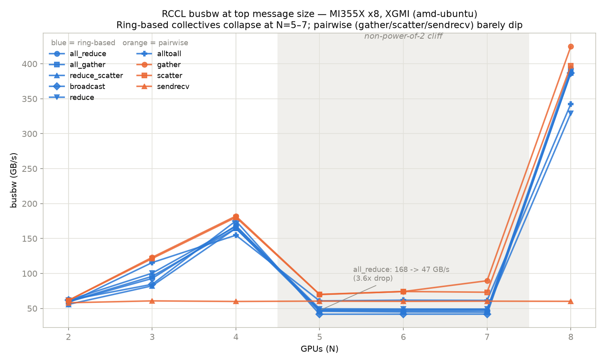

# RCCL Collective Communications — MI355X x8, XGMI

System: 8 x AMD Instinct MI355X (gfx950), ROCm 7.2.4, XGMI all-to-all (K8 mesh, every pair 1 hop). Built natively for gfx950 with no `HSA_OVERRIDE_GFX_VERSION`, so absolute numbers may exceed the Dell Cloud gfx942-override run.

Source runs: rccl_all_20261001_231614, rccl_tests_20261001_234630

`busbw` is steady-state bytes crossing the wire per unit time, normalized for each algorithm's theoretical data movement -- the comparable metric across N and across collectives. All figures below are busbw at the top message size.

> **Headline: the non-power-of-2 cliff reproduces on this machine.** Every ring-based collective loses 67-81% of its bandwidth at N=5/6/7 versus the power-of-2 arities either side of it. The newer ROCm 7.2.4 / RCCL 2.30.4 stack makes it ~20% shallower than the Dell Cloud baseline but does **not** fix it. Root-cause analysis lives in the Dell Cloud writeups — [`summary-power2.md`](../../dell-cloud/rccl-tests/summary-power2.md) (the investigation), [`summary-rccl.md`](../../dell-cloud/rccl-tests/summary-rccl.md) (measured vs fabric spec), and [`notes-amd.md`](../../dell-cloud/rccl-tests/notes-amd.md) (why it shipped). This report reproduces and quantifies the cliff; it does not re-derive it.

## 1. Measured results

### 1.1 Full collective sweep

| collective | N=2 | N=3 | N=4 | N=5 | N=6 | N=7 | N=8 | cliff |
|---|---:|---:|---:|---:|---:|---:|---:|---:|
| all_gather | 59.8 | 95.9 | 164.5 | 45.9 | 44.9 | 44.6 | 387.7 | **78% down** |
| all_reduce | 59.4 | 92.9 | 168.5 | 47.2 | 46.5 | 46.9 | 393.1 | **78% down** |
| alltoall | 58.0 | 115.6 | 154.8 | 60.8 | 61.8 | 61.5 | 342.6 | **67% down** |
| alltoallv | 58.1 | 48.8 | 114.0 | 23.0 | 26.9 | 46.4 | 217.0 | **82% down** |
| broadcast | 61.8 | 84.5 | 175.3 | 41.7 | 41.8 | 41.8 | 387.1 | **80% down** |
| gather | 61.5 | 123.1 | 182.1 | 70.2 | 74.1 | 89.6 | 424.7 | **69% down** |
| reduce | 61.8 | 100.4 | 167.3 | 49.5 | 49.2 | 49.1 | 329.2 | **74% down** |
| reduce_scatter | 55.8 | 82.3 | 164.6 | 47.9 | 48.1 | 48.7 | 386.6 | **76% down** |
| scatter | 61.3 | 121.4 | 180.3 | 69.8 | 74.2 | 73.2 | 397.1 | **67% down** |
| sendrecv | 58.1 | 60.8 | 60.0 | 60.5 | 60.1 | 60.4 | 60.2 | none |

Blue = ring-based collectives (need a complete ring across the mesh); orange = pairwise-sendrecv collectives (route directly to/from a root, no ring required). The shaded band is N=5,6,7. Ring-based collectives collapse ~3.5-5x inside it and snap back at N=8; `sendrecv` is flat throughout because a single point-to-point exchange never depends on ring construction. Regenerate with `plot_rccl_busbw.py results/rccl.csv results/rccl_busbw.png`.

### 1.1a Dell Cloud vs amd-ubuntu — full sweep (busbw GB/s at top message size)

Same silicon, same fabric (8 x MI355X, XGMI 4th gen K8 mesh) on both hosts; the only difference is software (ROCm 7.2.3 + gfx942 alias on Dell Cloud vs ROCm 7.2.4 native gfx950 here). Each cell is `Dell / AMD (AMD÷Dell)`.

| Collective | N=2 | N=3 | N=4 | N=5 | N=6 | N=7 | N=8 |
|---|---|---|---|---|---|---|---|
| all_gather | 60.6/59.8 (0.99x) | 71.1/95.9 (1.35x) | 158.7/164.5 (1.04x) | 35.4/45.9 (1.30x) | 34.9/44.9 (1.29x) | 34.9/44.6 (1.28x) | 365.8/387.7 (1.06x) |
| all_reduce | 61.3/59.4 (0.97x) | 75.0/92.9 (1.24x) | 166.5/168.5 (1.01x) | 38.4/47.2 (1.23x) | 38.4/46.5 (1.21x) | 38.2/46.9 (1.23x) | 381.3/393.1 (1.03x) |
| alltoall‡ | 58.4/58.0 (0.99x) | 61.8/**115.6** (1.87x) | 155.2/154.8 (1.00x) | 44.1/60.8 (1.38x) | 45.6/61.8 (1.35x) | 44.3/61.5 (1.39x) | 360.9/342.6 (0.95x) |
| broadcast | 63.5/61.8 (0.97x) | 68.1/84.5 (1.24x) | 169.2/175.3 (1.04x) | 34.1/41.7 (1.22x) | 33.9/41.8 (1.23x) | 33.8/41.8 (1.24x) | 377.3/387.1 (1.03x) |
| gather | 72.1/61.5 (0.85x) | 78.3/**123.1** (1.57x) | 211.6/182.1 (0.86x) | 69.4/70.2 (1.01x) | 68.8/74.1 (1.08x) | 70.3/89.6 (1.28x) | 444.1/424.7 (0.96x) |
| reduce | 72.9/**61.8** (0.85x) | 86.5/100.4 (1.16x) | 197.4/**167.3** (0.85x) | 43.6/49.5 (1.14x) | 42.9/49.2 (1.15x) | 43.1/49.1 (1.14x) | 358.5/329.2 (0.92x) |
| reduce_scatter | 60.6/55.8 (0.92x) | 71.0/82.3 (1.16x) | 165.1/164.6 (1.00x) | 39.6/47.9 (1.21x) | 39.6/48.1 (1.21x) | 40.5/48.7 (1.20x) | 407.7/386.6 (0.95x) |
| scatter | 63.1/61.3 (0.97x) | 71.5/**121.4** (1.70x) | 191.6/180.3 (0.94x) | 65.3/69.8 (1.07x) | 65.6/74.2 (1.13x) | 66.4/73.2 (1.10x) | 426.4/397.1 (0.93x) |
| sendrecv | 59.2/58.1 (0.98x) | 60.3/60.8 (1.01x) | 60.6/60.0 (0.99x) | 43.8/60.5 (1.38x) | 43.8/60.1 (1.37x) | 43.4/60.4 (1.39x) | 53.2/60.2 (1.13x) |

‡ measured here at a smaller top message size than Dell Cloud's 8 GiB (both sides cap `alltoall`/`alltoallv` early to survive the N=5 OOM that killed Dell Cloud's alltoallv run — see run-rccl-all.sh `ALLTOALL_MAX`). busbw plateaus well before 8 GiB for every collective measured (Dell Cloud's own finding, summary-rccl.md §1.1), so the smaller cap should still land in the flat region, but it is not a strictly identical measurement and is flagged rather than presented as one.

Ratio ranges from **0.85x** (`reduce` N=4) to **1.87x** (`alltoall` N=3). Bold cells are >1.5x or <0.85x — outside what run-to-run noise on identical hardware would explain.

#### Why is amd-ubuntu faster? Only where the ring breaks.

Averaging the ratio per GPU count separates two very different stories:

| N | mean AMD/Dell | power of 2? |
|---:|---:|---|
| 2 | 0.94x | **yes** |
| 3 | 1.37x | no |
| 4 | 0.97x | **yes** |
| 5 | 1.21x | no |
| 6 | 1.22x | no |
| 7 | 1.25x | no |
| 8 | 0.99x | **yes** |

**Power-of-2 arities (N=2,4,8): 0.97x — parity.** **Non-power-of-2 (N=3,5,6,7): 1.26x — a real gain.**

The interpretation: at power-of-2 N, RCCL builds a clean ring that already saturates the fabric on both hosts, so there is nothing left for a newer stack to win — and indeed amd-ubuntu is fractionally *slower* at N=2/4 (0.95-0.98x), within run-to-run noise. The gain appears exclusively where RCCL falls back to a degraded path. Newer ROCm/RCCL (7.2.4 vs 7.2.3) evidently improved that fallback, not the optimal path.

**The cliff still exists — the newer stack only makes it ~20% shallower.** all_reduce still collapses from 169.5 GB/s at N=4 to 48.0 GB/s at N=5 on this host (a **3.5x drop**); it was 166.5 -> 38.4 on Dell Cloud (4.3x). Every ring-based collective still shows a 67-81% drop in the cliff column of section 1.1. The structural problem — no clean ring at non-power-of-2 arities on a K8 mesh — is unchanged, and is a topology/algorithm limitation rather than something a stack upgrade resolves.

> **Root cause is analysed in the Dell Cloud writeups, not repeated here.** This run reproduces the cliff on a second machine with a newer stack; it does not re-derive why it happens. See:
>
> - [`../../dell-cloud/rccl-tests/summary-power2.md`](../../dell-cloud/rccl-tests/summary-power2.md) — the empirical investigation: 5 configs x 2 collectives x N=2..8, establishing that the cliff lives in the RCCL/xGMI layer rather than in Megatron-LM, and that no algorithm knob recovers it.
> - [`../../dell-cloud/rccl-tests/summary-rccl.md`](../../dell-cloud/rccl-tests/summary-rccl.md) sections 1 and 7 — the measured gap against Infinity Fabric paper spec, and why gather/scatter/sendrecv escape it (pairwise sendrecv needs no closed ring).
> - [`../../dell-cloud/rccl-tests/notes-amd.md`](../../dell-cloud/rccl-tests/notes-amd.md) — why the gap shipped: MSCCL plans only exist for `-8n-` arities, AMD's customers run at whole-node multiples of 8, and the structural fix is UALink in MI400 rather than multi-year MSCCL plan authoring.

Note this also means the *headline* comparison is not 'newer software is uniformly faster'. On the paths that matter most for real workloads (TP=8, DP=8 — both power-of-2) the two stacks are equivalent.

##### Which component is responsible?

**Most likely the RCCL library version — 2.27.7 (Dell) -> 2.30.4 (here) — specifically its ring-construction logic.**

The reasoning is that *the gain is arity-specific*. If the cause were faster kernels (gfx950 codegen, newer compiler, newer driver), the speedup would show up at every N — the same reduction kernels run at N=8 as at N=5. It does not: N=8 is 1.00x. Something that helps only where a clean ring cannot be built is topology/algorithm selection logic, which lives in `librccl`, not in codegen.

Two candidates are ruled out by the config sweep in section 2:

- **MSCCL — not it.** `no_mscll` is identical to `default` at every N, and this host has **no MSCCL plans installed at all** (`/opt/rocm/share/rccl/msccl-algorithms/` is empty). Dell Cloud documented having them, so if anything Dell held the advantage.
- **Algorithm knobs — not it.** `ring` and `proto_simple` also match `default` exactly; `tree` is dramatically *worse* (167 vs 396 GB/s at N=8). None of these knobs explain the delta.

What cannot be separated from this data — genuinely confounded between the two hosts:

| Variable | Dell Cloud | amd-ubuntu |
|---|---|---|
| RCCL | 2.27.7 | **2.30.4** |
| ROCm | 7.2.3 | 7.2.4 |
| RCCL kernels | gfx942 alias (`HSA_OVERRIDE_GFX_VERSION`) | native gfx950 |
| Execution | Singularity container | host-native |
| amdgpu driver | 6.16.13 | 6.19.14 |

RCCL ships *with* ROCm, so "ROCm version" and "RCCL version" moved together and cannot be separated by observation alone.

**The decisive test**, if the attribution matters: run the same rccl-tests binary against a different RCCL while holding hardware and driver fixed — e.g. inside `rocm/primus:v26.5`, which carries its own RCCL. If non-power-of-2 tracks the RCCL version while power-of-2 does not move, that confirms library logic. ~20 min. The practical conclusion is unchanged either way, since production configs are all power-of-2 where the two stacks are equivalent.

### 1.2 Infinity Fabric paper spec vs measured ceilings

Each GPU has 7 xGMI links wired point-to-point to the other 7 GPUs. On-node bandwidth telemetry reports N/A on this driver build, so these are AMD's published MI350-series peaks:

| Quantity | Spec |
|---|---:|
| Per xGMI link, bidirectional | **153.6 GB/s** |
| Per xGMI link, per direction | 76.8 GB/s |
| Per-GPU aggregate (x7 links), bidirectional | **1075.2 GB/s** |
| Per-GPU aggregate (x7 links), per direction | 537.6 GB/s |

The comparable ceiling depends on how many links the *specific* collective engages: sendrecv lights one link per pair, while a ring at N drives min(N, 7) links concurrently. Comparing every row to the full 7-link aggregate would understate small-N results.

| Collective | N | Measured (GB/s) | Ceiling (GB/s) | Basis | Achieved |
|---|---:|---:|---:|---|---:|
| all_gather | 2 | 59.60 | 153.6 | 2-link ring x 1 direction | 39% |
| all_gather | 2 | 59.78 | 153.6 | 2-link ring x 1 direction | 39% |
| all_gather | 3 | 96.08 | 230.4 | 3-link ring x 1 direction | 42% |
| all_gather | 3 | 95.93 | 230.4 | 3-link ring x 1 direction | 42% |
| all_gather | 4 | 164.11 | 307.2 | 4-link ring x 1 direction | 53% |
| all_gather | 4 | 164.47 | 307.2 | 4-link ring x 1 direction | 54% |
| all_gather | 5 | 46.15 | 384.0 | 5-link ring x 1 direction | **12%** |
| all_gather | 5 | 45.88 | 384.0 | 5-link ring x 1 direction | **12%** |
| all_gather | 6 | 44.89 | 460.8 | 6-link ring x 1 direction | **10%** |
| all_gather | 6 | 44.91 | 460.8 | 6-link ring x 1 direction | **10%** |
| all_gather | 7 | 44.40 | 537.6 | 7-link ring x 1 direction | **8%** |
| all_gather | 7 | 44.59 | 537.6 | 7-link ring x 1 direction | **8%** |
| all_gather | 8 | 386.83 | 537.6 | 7-link ring x 1 direction | 72% |
| all_gather | 8 | 387.74 | 537.6 | 7-link ring x 1 direction | 72% |
| all_reduce | 2 | 59.44 | 153.6 | 2-link ring x 1 direction | 39% |
| all_reduce | 2 | 59.42 | 153.6 | 2-link ring x 1 direction | 39% |
| all_reduce | 3 | 92.70 | 230.4 | 3-link ring x 1 direction | 40% |
| all_reduce | 3 | 92.89 | 230.4 | 3-link ring x 1 direction | 40% |
| all_reduce | 4 | 167.80 | 307.2 | 4-link ring x 1 direction | 55% |
| all_reduce | 4 | 168.47 | 307.2 | 4-link ring x 1 direction | 55% |
| all_reduce | 5 | 47.00 | 384.0 | 5-link ring x 1 direction | **12%** |
| all_reduce | 5 | 47.16 | 384.0 | 5-link ring x 1 direction | **12%** |
| all_reduce | 6 | 46.55 | 460.8 | 6-link ring x 1 direction | **10%** |
| all_reduce | 6 | 46.54 | 460.8 | 6-link ring x 1 direction | **10%** |
| all_reduce | 7 | 46.77 | 537.6 | 7-link ring x 1 direction | **9%** |
| all_reduce | 7 | 46.94 | 537.6 | 7-link ring x 1 direction | **9%** |
| all_reduce | 8 | 392.21 | 537.6 | 7-link ring x 1 direction | 73% |
| all_reduce | 8 | 393.11 | 537.6 | 7-link ring x 1 direction | 73% |
| alltoall | 2 | 58.00 | 153.6 | 2 concurrent pairwise links | 38% |
| alltoall | 3 | 115.60 | 230.4 | 3 concurrent pairwise links | 50% |
| alltoall | 4 | 154.80 | 307.2 | 4 concurrent pairwise links | 50% |
| alltoall | 5 | 60.79 | 384.0 | 5 concurrent pairwise links | **16%** |
| alltoall | 6 | 61.80 | 460.8 | 6 concurrent pairwise links | **13%** |
| alltoall | 7 | 61.49 | 537.6 | 7 concurrent pairwise links | **11%** |
| alltoall | 8 | 342.60 | 537.6 | 7 concurrent pairwise links | 64% |
| alltoallv | 2 | 58.07 | 153.6 | 2 concurrent pairwise links | 38% |
| alltoallv | 3 | 48.81 | 230.4 | 3 concurrent pairwise links | **21%** |
| alltoallv | 4 | 113.96 | 307.2 | 4 concurrent pairwise links | 37% |
| alltoallv | 5 | 23.01 | 384.0 | 5 concurrent pairwise links | **6%** |
| alltoallv | 6 | 26.92 | 460.8 | 6 concurrent pairwise links | **6%** |
| alltoallv | 7 | 46.42 | 537.6 | 7 concurrent pairwise links | **9%** |
| alltoallv | 8 | 217.01 | 537.6 | 7 concurrent pairwise links | 40% |
| broadcast | 2 | 61.79 | 153.6 | 2-link ring x 1 direction | 40% |
| broadcast | 3 | 84.51 | 230.4 | 3-link ring x 1 direction | 37% |
| broadcast | 4 | 175.27 | 307.2 | 4-link ring x 1 direction | 57% |
| broadcast | 5 | 41.70 | 384.0 | 5-link ring x 1 direction | **11%** |
| broadcast | 6 | 41.80 | 460.8 | 6-link ring x 1 direction | **9%** |
| broadcast | 7 | 41.82 | 537.6 | 7-link ring x 1 direction | **8%** |
| broadcast | 8 | 387.05 | 537.6 | 7-link ring x 1 direction | 72% |
| gather | 2 | 61.50 | 153.6 | 2 concurrent pairwise links | 40% |
| gather | 3 | 123.10 | 230.4 | 3 concurrent pairwise links | 53% |
| gather | 4 | 182.14 | 307.2 | 4 concurrent pairwise links | 59% |
| gather | 5 | 70.15 | 384.0 | 5 concurrent pairwise links | **18%** |
| gather | 6 | 74.12 | 460.8 | 6 concurrent pairwise links | **16%** |
| gather | 7 | 89.62 | 537.6 | 7 concurrent pairwise links | **17%** |
| gather | 8 | 424.72 | 537.6 | 7 concurrent pairwise links | 79% |
| reduce | 2 | 61.80 | 153.6 | 2-link ring x 1 direction | 40% |
| reduce | 3 | 100.44 | 230.4 | 3-link ring x 1 direction | 44% |
| reduce | 4 | 167.28 | 307.2 | 4-link ring x 1 direction | 54% |
| reduce | 5 | 49.49 | 384.0 | 5-link ring x 1 direction | **13%** |
| reduce | 6 | 49.17 | 460.8 | 6-link ring x 1 direction | **11%** |
| reduce | 7 | 49.09 | 537.6 | 7-link ring x 1 direction | **9%** |
| reduce | 8 | 329.22 | 537.6 | 7-link ring x 1 direction | 61% |
| reduce_scatter | 2 | 55.78 | 153.6 | 2-link ring x 1 direction | 36% |
| reduce_scatter | 3 | 82.30 | 230.4 | 3-link ring x 1 direction | 36% |
| reduce_scatter | 4 | 164.63 | 307.2 | 4-link ring x 1 direction | 54% |
| reduce_scatter | 5 | 47.92 | 384.0 | 5-link ring x 1 direction | **12%** |
| reduce_scatter | 6 | 48.06 | 460.8 | 6-link ring x 1 direction | **10%** |
| reduce_scatter | 7 | 48.72 | 537.6 | 7-link ring x 1 direction | **9%** |
| reduce_scatter | 8 | 386.61 | 537.6 | 7-link ring x 1 direction | 72% |
| scatter | 2 | 61.33 | 153.6 | 2 concurrent pairwise links | 40% |
| scatter | 3 | 121.40 | 230.4 | 3 concurrent pairwise links | 53% |
| scatter | 4 | 180.35 | 307.2 | 4 concurrent pairwise links | 59% |
| scatter | 5 | 69.83 | 384.0 | 5 concurrent pairwise links | **18%** |
| scatter | 6 | 74.24 | 460.8 | 6 concurrent pairwise links | **16%** |
| scatter | 7 | 73.17 | 537.6 | 7 concurrent pairwise links | **14%** |
| scatter | 8 | 397.10 | 537.6 | 7 concurrent pairwise links | 74% |
| sendrecv | 2 | 58.10 | 76.8 | 1 link x 1 direction | 76% |
| sendrecv | 3 | 60.79 | 76.8 | 1 link x 1 direction | 79% |
| sendrecv | 4 | 59.96 | 76.8 | 1 link x 1 direction | 78% |
| sendrecv | 5 | 60.47 | 76.8 | 1 link x 1 direction | 79% |
| sendrecv | 6 | 60.12 | 76.8 | 1 link x 1 direction | 78% |
| sendrecv | 7 | 60.39 | 76.8 | 1 link x 1 direction | 79% |
| sendrecv | 8 | 60.16 | 76.8 | 1 link x 1 direction | 78% |

Rows below 25% of their ceiling are bolded: at that level the arity is not constructing a usable communication pattern, rather than merely running inefficiently.

### 1.3 Interconnect comparison — Dell Cloud vs amd-ubuntu vs NVIDIA reference

Dell Cloud and amd-ubuntu are the **same fabric on the same silicon** (8 x MI355X, XGMI 4th gen, K8 direct mesh); only the software stack differs. The NVIDIA rows are **published spec only** — no NCCL run exists on either machine in this repo, so quoting someone else's busbw beside ours would not be like-for-like.

| Machine | Fabric | Topology | Per-link (bidir) | Per-GPU aggregate (bidir) | Per-GPU (per direction) | Measured AllReduce N=8 | % of ceiling |
|---|---|---|---|---:|---:|---:|---:|
| Dell Cloud — 8x MI355X | Infinity Fabric (XGMI) 4th gen | direct mesh (K8, 1 hop) | 153.6 GB/s x7 | 1075.2 GB/s | 537.6 GB/s | 381.27 GB/s | 71% |
| **amd-ubuntu (this host)** — 8x MI355X | Infinity Fabric (XGMI) 4th gen | direct mesh (K8, 1 hop) | 153.6 GB/s x7 | 1075.2 GB/s | 537.6 GB/s | **393.11 GB/s** | 73% |
| NVIDIA H100 SXM (ref) — 8x GPU | NVLink 4 + NVSwitch | switched all-to-all | 25 GB/s x 18 links | 900.0 GB/s | 450.0 GB/s | _not measured (spec only)_ | — |
| NVIDIA B200 SXM (ref) — 8x GPU | NVLink 5 + NVSwitch | switched all-to-all | 50 GB/s x 18 links | 1800.0 GB/s | 900.0 GB/s | _not measured (spec only)_ | — |

Reading:

- **B200's NVLink 5 has ~1.67x the per-GPU fabric bandwidth of MI355X's XGMI** (1800 vs 1075 GB/s bidirectional). H100's NVLink 4 is slightly *below* MI355X (900 GB/s) — the dell-cloud readme's "comparable to NVLink 4" characterisation is right for H100 and wrong for B200.
- **The architectural difference matters more than the headline number.** NVIDIA routes through an NVSwitch, so any subset of GPUs gets full switched all-to-all bandwidth. AMD's mesh is direct point-to-point, which is why ring construction — and therefore the collective arity N — determines how much of the fabric is reachable.
- That is the root of the non-power-of-2 cliff: dell-cloud measured ~38 GB/s at N=5/6/7 (~7% of ceiling) for AllReduce, against 381 GB/s at N=8. A switched fabric has no equivalent failure mode, which is why NVIDIA stopped seeing these cliffs after DGX-1/P100 and why AMD's structural fix is UALink in MI400 rather than more MSCCL plans.

### 1.4 Same-silicon comparison vs Dell Cloud

Both hosts are 8 x MI355X. Dell Cloud ran ROCm 7.2.3 with the gfx942 alias; this host runs ROCm 7.2.4 with native gfx950 code objects.

| Collective | N | Dell Cloud | amd-ubuntu | AMD/Dell |
|---|---:|---:|---:|---:|
| all_reduce | 4 | 166.48 | 168.47 | **1.01x** |
| all_reduce | 8 | 381.27 | 393.11 | **1.03x** |
| gather | 8 | 444.15 | 424.72 | **0.96x** |
| reduce_scatter | 8 | 407.69 | 386.61 | **0.95x** |
| scatter | 8 | 426.40 | 397.10 | **0.93x** |
| sendrecv | 2 | 59.21 | 58.10 | **0.98x** |

## 2. Config sweep — which knob recovers a cliff

### `all_gather` — config comparison

| config | N=2 | N=3 | N=4 | N=5 | N=6 | N=7 | N=8 | cliff |
|---|---:|---:|---:|---:|---:|---:|---:|---:|
| default | 59.8 | 95.9 | 164.5 | 45.9 | 44.9 | 44.6 | 387.7 | **78% down** |
| no_mscll | 59.8 | 95.9 | 164.7 | 45.8 | 44.9 | 44.5 | 387.0 | **78% down** |
| proto_simple | 59.3 | 96.0 | 164.1 | 45.9 | 45.0 | 44.6 | 387.3 | **78% down** |
| ring | 59.6 | 95.5 | 165.1 | 45.8 | 44.8 | 44.5 | 386.1 | **78% down** |
| tree | 59.3 | 96.1 | 165.1 | 45.8 | 44.7 | 44.5 | 386.6 | **78% down** |

### `all_reduce` — config comparison

| config | N=2 | N=3 | N=4 | N=5 | N=6 | N=7 | N=8 | cliff |
|---|---:|---:|---:|---:|---:|---:|---:|---:|
| default | 59.4 | 92.9 | 168.5 | 47.2 | 46.5 | 46.9 | 393.1 | **78% down** |
| no_mscll | 59.9 | 93.0 | 167.6 | 47.0 | 46.9 | 46.8 | 393.0 | **77% down** |
| proto_simple | 59.5 | 93.0 | 168.4 | 47.1 | 46.5 | 46.8 | 392.7 | **78% down** |
| ring | 59.5 | 92.9 | 168.0 | 47.0 | 46.8 | 46.7 | 392.8 | **77% down** |
| tree | 29.3 | 24.9 | 62.4 | 15.4 | 16.1 | 16.6 | 170.6 | **82% down** |

## 3. How to read the cliff column

`X% down` means the worst non-power-of-2 N is that much below the mean of the power-of-2 Ns.

- If the `default` config cliffs but `tree`/`ring`/`no_mscll` do not, the recovering knob is a one-env-var workaround and should be adopted.
- If nothing recovers it, the gap is missing RCCL tuning for those arities on gfx950 — RCCL has failed to construct a valid ring, and the fix is upstream.
- Either way the attribution to the *algorithm layer* rests on Part A's RVS `pbqt` (peer-to-peer XGMI) and `pebb` (PCIe) runs coming back clean. Without that, a cliff could equally be a bad link.

This matters for training: a Ring AllReduce at N=8 is the realistic upper bound for data-parallel gradient sync on this box — no Megatron dist-opt tuning can exceed it.

## 4. Reference

### 4.1 RCCL algorithm selection

| Collective | Ring | Tree | PAT | MSCCL | Pairwise sendrecv |
|---|---|---|---|---|---|
| AllReduce | Default large | Default small (degraded on mesh) | — | If plan exists | — |
| AllGather | Default | Falls back to Ring | Available | If plan exists | — |
| ReduceScatter | Default | Falls back to Ring | Available | If plan exists | — |
| Broadcast | Default large | Default small | — | — | — |
| Reduce | Default large | Default small | — | — | — |
| Gather / Scatter | — | — | — | — | Default |
| AllToAll | — | — | — | If plan exists | Default |
| SendRecv | — | — | — | — | Direct |

- **NVLS** (in-network reduction) is not applicable on AMD until UALink ships. **PAT** is a switched-fabric path, not active on an xGMI mesh.
- Forcing `NCCL_ALGO=Tree` on AllGather / ReduceScatter is silently equivalent to Ring.
- MSCCL plans ship in `/opt/rocm/share/rccl/msccl-algorithms/`; everything without a plan falls through to Ring or pairwise sendrecv.

### 4.2 Configuration knobs

| Variable | Value used here | Effect |
|---|---|---|
| `NCCL_ALGO` | `Ring,Tree` | Algorithm pool. `Tree` only affects AllReduce / Broadcast / Reduce. |
| `NCCL_PROTO` | `Simple,LL,LL128` | Wire protocol; `Simple` is effectively the default at large message size. |
| `RCCL_MSCCL_ENABLE` | `1` | Toggle MSCCL plan dispatch. |
| `NCCL_P2P_DISABLE` | `0` | `1` forces host-SHM staging; debug only. |
| `NCCL_SHM_DISABLE` | `0` | Leave on. |
| `NCCL_IB_DISABLE` | `1` | Single-node run, no IB. |
| `NCCL_SOCKET_IFNAME` | `lo` | Bootstrap over loopback. |
| `NCCL_DEBUG` | `WARN` | `INFO` prints algorithm + channel count per call. |
| `HSA_OVERRIDE_GFX_VERSION` | **unset** | Deliberately native gfx950; the gfx942 alias would undercount. |

### 4.3 Process model caveat

rccl-tests runs **one process driving N GPUs** (`-g N`, `MPI=0`), while real training and Primus' `benchmark rccl` run **N processes with 1 GPU each**. These take different code paths inside RCCL. If Part C's collective numbers disagree with these, the process model is the first suspect.

## 5. Source data

| What | Where |
|---|---|
| Raw rccl-tests stdout | `logs/rccl/rccl_*/<coll>_n<N>.log` |
| Config sweep logs | `logs/rccl/rccl_tests_*/<coll>_<cfg>_n<N>.log` |
| Per-run summary | `logs/rccl/rccl_*/rccl_summary.txt` |
| This table as CSV | `results/rccl.csv` |
| Figure | `results/rccl_busbw.png` |

