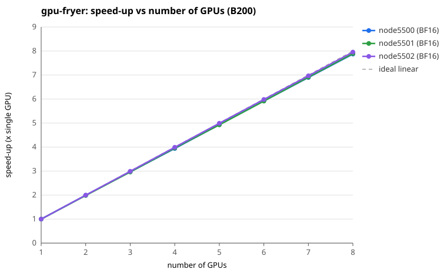

# gpu-fryer summary

- Generated: 2026-08-06 17:19:05
- Nodes: node5500 (8 x B200), node5501 (8 x B200), node5502 (8 x B200)
- Note: node5500-5502 are no longer in Slurm. The tables below are their historical baseline; the current hardware is the 7 new nodes covered in "New nodes" below.
- Precisions: FP32, BF16, FP8
- Reference (MIT aicr-benchmarks, `gpu-fryer/summary.md`, b0025, **B200**): per-GPU mean TFLOP/s — FP32 772, BF16 1500, FP8 4115

## Per-node mean converged throughput (TFLOP/s)

| Node | GPU | FP32 | BF16 | FP8 | Health |
|------|-----|------:|------:|------:|---|
| node5500 | B200 | 744 | 1457 | 3990 | ok |
| node5501 | B200 | 748 | 1457 | 4001 | ok |
| node5502 | B200 | 760 | 1437 | 4062 | ok |
| **reference (b0025)** | **B200** | **772** | **1500** | **4115** | — |

### % of B200 reference (mean, B200 nodes only)

| Node | FP32 | BF16 | FP8 |
|------|------:|------:|------:|
| node5500 | 96% | 97% | 97% |
| node5501 | 97% | 97% | 97% |
| node5502 | 98% | 96% | 99% |

## New nodes (node5600/5601/5602/5702/5800/5801/5802)

Run 2026-08-24 on the 7 new B200 nodes, same configuration as above (300 s per
precision, all 8 GPUs, 7 single-node jobs).

**They match the nodes above — no separate tables needed.** Per-node means land
at FP32 740-752, BF16 1451-1465, FP8 3949-4032 TFLOP/s. Against the node5500-5502
means the 7-node means differ by **-0.4% (FP32), +0.5% (BF16), -0.3% (FP8)**, and
no individual node is more than **1.7%** away on any precision (worst:
node5600-c1, FP8). Every node lands at 96-98% of the b0025 B200 reference, the
same band the old nodes occupied.

**All 7 are healthy.** gpu-fryer reports "All GPUs seem healthy" on every node;
no HW, thermal-SW or thermal-HW throttling flag was raised on any of the 56 GPUs.
Per-GPU uniformity is also unchanged: at 8 GPUs the derived speed-up is
7.81-7.88x, against 7.87-8.03x on the old nodes.

## Speed-up vs number of GPUs

Shown for **node5500**, one curve per precision.

| #GPUs | BF16 | FP32 | FP8 | ideal |
|------:|------:|------:|------:|------:|
| 1 | 1.00 | 1.00 | 1.00 | 1.00 |
| 2 | 1.99 | 2.02 | 2.00 | 2.00 |
| 3 | 2.97 | 3.02 | 2.97 | 3.00 |
| 4 | 3.94 | 4.01 | 3.95 | 4.00 |
| 5 | 4.93 | 5.03 | 4.93 | 5.00 |
| 6 | 5.92 | 6.03 | 5.93 | 6.00 |
| 7 | 6.90 | 7.03 | 6.90 | 7.00 |
| 8 | 7.87 | 8.03 | 7.88 | 8.00 |

The other nodes (node5501, node5502) are close and are omitted from the plot to keep it readable: at 8 GPUs node5500 reaches BF16 7.87x, FP32 8.03x, FP8 7.88x, and no other node differs by more than **0.16x** on any precision.

> **How to read this.** gpu-fryer stresses all 8 GPUs *concurrently* and reports one converged figure per GPU — it does not run separate 1, 2, ... 8-GPU jobs. The curve above is therefore **derived** from that single run: speed-up(N) = (sum of GPUs 0..N-1) / GPU 0. It is linear by construction and is **not** a measured scaling study; what it shows is per-GPU *uniformity* — a curve that tracks the dashed ideal line means every GPU sustains the same throughput, while a curve bending below it marks a slow or throttling GPU. For real scaling behaviour see the Megatron-LM weak-scaling results in `output-megatron/summary.md`.

## Per-GPU converged throughput (TFLOP/s)

### node5500 (8 x B200)

| GPU | FP32 | BF16 | FP8 |
|-----|------:|------:|------:|
| 0 | 740.9 | 1480.4 | 4049.2 |
| 1 | 755.1 | 1470.5 | 4064.6 |
| 2 | 738.5 | 1440.6 | 3921.7 |
| 3 | 736.1 | 1439.6 | 3940.8 |
| 4 | 752.7 | 1470.3 | 4002.6 |
| 5 | 747.9 | 1458.6 | 4035.6 |
| 6 | 740.8 | 1450.2 | 3920.9 |
| 7 | 740.9 | 1444.2 | 3988.4 |
| **min** | **736.1** | **1439.6** | **3920.9** |
| **mean** | **744.1** | **1456.8** | **3990.5** |
| **max** | **755.1** | **1480.4** | **4064.6** |

### node5501 (8 x B200)

| GPU | FP32 | BF16 | FP8 |
|-----|------:|------:|------:|
| 0 | 759.2 | 1476.6 | 4059.5 |
| 1 | 747.3 | 1452.8 | 4012.1 |
| 2 | 742.4 | 1446.1 | 3993.2 |
| 3 | 754.4 | 1469.3 | 4026.3 |
| 4 | 735.4 | 1429.2 | 3974.8 |
| 5 | 749.6 | 1460.4 | 4045.5 |
| 6 | 751.9 | 1471.7 | 3936.2 |
| 7 | 740.0 | 1446.1 | 3960.1 |
| **min** | **735.4** | **1429.2** | **3936.2** |
| **mean** | **747.5** | **1456.5** | **4001.0** |
| **max** | **759.2** | **1476.6** | **4059.5** |

### node5502 (8 x B200)

| GPU | FP32 | BF16 | FP8 |
|-----|------:|------:|------:|
| 0 | 759.7 | 1445.1 | 4087.0 |
| 1 | 769.3 | 1441.1 | 4113.7 |
| 2 | 755.0 | 1434.7 | 4048.0 |
| 3 | 764.5 | 1447.6 | 4092.0 |
| 4 | 766.8 | 1444.8 | 4063.4 |
| 5 | 757.4 | 1432.0 | 4011.1 |
| 6 | 755.1 | 1424.9 | 4058.6 |
| 7 | 754.5 | 1425.6 | 4026.0 |
| **min** | **754.5** | **1424.9** | **4011.1** |
| **mean** | **760.3** | **1437.0** | **4062.5** |
| **max** | **769.3** | **1447.6** | **4113.7** |

Converged = the final sustained-average throughput gpu-fryer reports per GPU at the end of each precision run. Higher is better; large spread across GPUs or any throttling flag indicates a problem.

