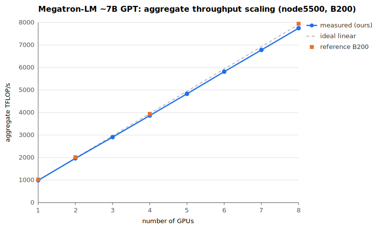

# Megatron-LM 1-node GPU sweep — B200

- Generated: 2026-07-15 11:23:18
- Node: node5500 (single node, data-parallel, TP=1, PP=1)
- Model: ~7B GPT — 36 layers, hidden 4096, FFN 14336, 32 heads, seq 2048, bf16
- Per run: micro-batch 4, global batch = 128 x total_GPUs, 100 iters, no activation recompute
- Metric: last-iteration throughput (TFLOP/s/GPU), same as the reference
- Reference: MIT aicr-benchmarks `megatron-lm/output/summary.md`, B200 1-node group

## Apples-to-apple vs B200 reference

| #GPUs | GBS | ours TFLOP/s/GPU | reference TFLOP/s/GPU | ours / ref |
|------:|----:|-----------------:|----------------------:|-----------:|
| 1 | 128 | 989.0 | 1024.4 | 96.5% |
| 2 | 256 | 982.9 | 1007.7 | 97.5% |
| 4 | 512 | 967.0 | 985.2 | 98.2% |
| 8 | 1024 | 968.6 | 993.3 | 97.5% |

Reference values are the best B200 1-node result per GPU count from `summary.md` (last-iteration TFLOP/s/GPU).

## Scaling (1 -> 8 GPUs, single node)

| #GPUs | GBS | per-GPU TFLOP/s | aggregate TFLOP/s | iter (ms) | weak-scaling eff. | status |
|------:|----:|----------------:|------------------:|----------:|------------------:|--------|
| 1 | 128 | 989.0 | 989 | 11374 | 100.0% | ok |
| 2 | 256 | 982.9 | 1966 | 11446 | 99.4% | ok |
| 3 | 384 | 969.8 | 2909 | 11599 | 98.1% | ok |
| 4 | 512 | 967.0 | 3868 | 11634 | 97.8% | ok |
| 5 | 640 | 966.7 | 4834 | 11637 | 97.7% | ok |
| 6 | 768 | 969.1 | 5815 | 11608 | 98.0% | ok |
| 7 | 896 | 968.6 | 6780 | 11615 | 97.9% | ok |
| 8 | 1024 | 968.6 | 7749 | 11615 | 97.9% | ok |

Aggregate = per-GPU x #GPUs. Weak-scaling efficiency = per-GPU(N) / per-GPU(1). Per-GPU work is held constant (GBS scales with #GPUs).

## Scaling figure

Aggregate throughput vs #GPUs: measured (blue), ideal linear scaling from the 1-GPU point (dashed), and the B200 reference (orange).

