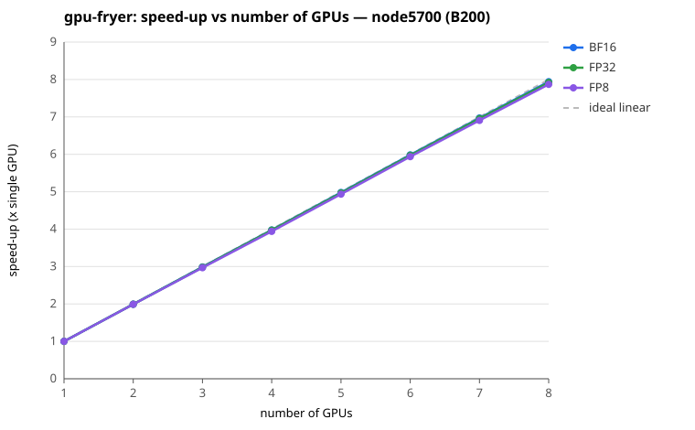

# gpu-fryer summary

- Generated: 2026-08-10 15:01:48
- Nodes: node5500 (8 x B200, Rocky 8), node5501 (8 x B200, Rocky 8), node5502 (8 x B200, Rocky 8), node5700 (8 x B200, Ubuntu 24.04), node5701 (8 x B200, Ubuntu 24.04)
- Precisions: FP32, BF16, FP8
- **node5500-5502 run Rocky 8; node5700-5701 run Ubuntu 24.04.** The speed-up plot and the per-GPU tables below cover the Ubuntu nodes; the Rocky 8 nodes appear in the per-node overview only, since their results are very close (see below). Full Rocky 8 detail: `../b200-nodes/out-gpu-fryer/summary.md`.

## Per-node mean converged throughput (TFLOP/s)

| Node | OS | GPU | FP32 | BF16 | FP8 | FP32 vs Rocky 8 | BF16 vs Rocky 8 | FP8 vs Rocky 8 | Health |
|------|----|-----|------:|------:|------:|------:|------:|------:|---|
| node5500 | Rocky 8 | B200 | 744 | 1457 | 3990 | baseline | baseline | baseline | ok |
| node5501 | Rocky 8 | B200 | 748 | 1457 | 4001 | baseline | baseline | baseline | ok |
| node5502 | Rocky 8 | B200 | 760 | 1437 | 4062 | baseline | baseline | baseline | ok |
| node5700 | Ubuntu 24.04 | B200 | 751 | 1458 | 4011 | +0.0% | +0.5% | -0.2% | ok |
| node5701 | Ubuntu 24.04 | B200 | 752 | 1460 | 4005 | +0.1% | +0.7% | -0.3% | ok |

## Speed-up vs number of GPUs

Shown for **node5700**, one curve per precision.

| #GPUs | BF16 | FP32 | FP8 | ideal |
|------:|------:|------:|------:|------:|
| 1 | 1.00 | 1.00 | 1.00 | 1.00 |
| 2 | 1.99 | 1.99 | 1.99 | 2.00 |
| 3 | 2.99 | 2.98 | 2.97 | 3.00 |
| 4 | 3.98 | 3.97 | 3.94 | 4.00 |
| 5 | 4.98 | 4.97 | 4.94 | 5.00 |
| 6 | 5.98 | 5.97 | 5.94 | 6.00 |
| 7 | 6.97 | 6.95 | 6.91 | 7.00 |
| 8 | 7.94 | 7.92 | 7.87 | 8.00 |

The other nodes (node5701) are essentially identical and are omitted from the plot to keep it readable: at 8 GPUs node5700 reaches BF16 7.94x, FP32 7.92x, FP8 7.87x, and no other node differs by more than **0.02x** on any precision.

> **How to read this.** gpu-fryer stresses all 8 GPUs *concurrently* and reports one converged figure per GPU — it does not run separate 1, 2, ... 8-GPU jobs. The curve above is therefore **derived** from that single run: speed-up(N) = (sum of GPUs 0..N-1) / GPU 0. It is linear by construction and is **not** a measured scaling study; what it shows is per-GPU *uniformity* — a curve that tracks the dashed ideal line means every GPU sustains the same throughput, while a curve bending below it marks a slow or throttling GPU. For real scaling behaviour see the Megatron-LM weak-scaling results in `output-megatron/summary.md`.

## Per-GPU converged throughput (TFLOP/s)

Ubuntu nodes (node5700, node5701). Per-GPU detail for the Rocky 8 nodes is omitted — they are very close, as quantified after the tables.

### node5700 (8 x B200)

| GPU | FP32 | BF16 | FP8 |
|-----|------:|------:|------:|
| 0 | 758.4 | 1468.6 | 4076.6 |
| 1 | 752.8 | 1460.1 | 4041.3 |
| 2 | 750.6 | 1459.4 | 3989.9 |
| 3 | 749.3 | 1452.6 | 3952.4 |
| 4 | 755.0 | 1471.9 | 4061.9 |
| 5 | 762.3 | 1476.4 | 4081.1 |
| 6 | 745.9 | 1448.4 | 3947.5 |
| 7 | 732.0 | 1424.5 | 3933.7 |
| **min** | **732.0** | **1424.5** | **3933.7** |
| **mean** | **750.8** | **1457.7** | **4010.6** |
| **max** | **762.3** | **1476.4** | **4081.1** |
| **vs Rocky 8** | **+0.0%** | **+0.5%** | **-0.2%** |

### node5701 (8 x B200)

| GPU | FP32 | BF16 | FP8 |
|-----|------:|------:|------:|
| 0 | 757.5 | 1471.9 | 4060.3 |
| 1 | 757.6 | 1476.9 | 4049.7 |
| 2 | 746.7 | 1453.3 | 3987.8 |
| 3 | 741.7 | 1439.0 | 3930.7 |
| 4 | 760.5 | 1472.5 | 4062.3 |
| 5 | 760.8 | 1477.0 | 4068.1 |
| 6 | 741.9 | 1452.9 | 3905.2 |
| 7 | 746.8 | 1434.2 | 3973.2 |
| **min** | **741.7** | **1434.2** | **3905.2** |
| **mean** | **751.7** | **1459.7** | **4004.6** |
| **max** | **760.8** | **1477.0** | **4068.1** |
| **vs Rocky 8** | **+0.1%** | **+0.7%** | **-0.3%** |

**The Rocky 8 nodes (node5500, node5501, node5502) are very close.** Their per-node mean throughput sits within **1.5%** of the Ubuntu node(s) on every precision (largest gap: node5502, BF16). Per-GPU tables and the speed-up plot for those nodes are in `../b200-nodes/out-gpu-fryer/summary.md`.

Converged = the final sustained-average throughput gpu-fryer reports per GPU at the end of each precision run. Higher is better; large spread across GPUs or any throttling flag indicates a problem.

