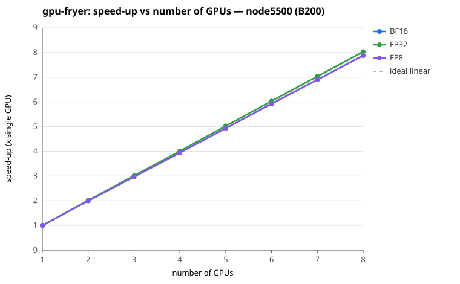

# gpu-fryer summary

- Generated: 2026-08-10 13:34:45
- Nodes: node5500 (8 x B200), node5501 (8 x B200), node5502 (8 x B200), node5700 (8 x B200)
- Precisions: FP32, BF16, FP8

## Per-node mean converged throughput (TFLOP/s)

| Node | GPU | FP32 | BF16 | FP8 | Health |
|------|-----|------:|------:|------:|---|
| node5500 | B200 | 744 | 1457 | 3990 | ok |
| node5501 | B200 | 748 | 1457 | 4001 | ok |
| node5502 | B200 | 760 | 1437 | 4062 | ok |
| node5700 | B200 | 751 | 1458 | 4011 | ok |

## Speed-up vs number of GPUs

Shown for **node5500**, one curve per precision.

| #GPUs | BF16 | FP32 | FP8 | ideal |
|------:|------:|------:|------:|------:|
| 1 | 1.00 | 1.00 | 1.00 | 1.00 |
| 2 | 1.99 | 2.02 | 2.00 | 2.00 |
| 3 | 2.97 | 3.02 | 2.97 | 3.00 |
| 4 | 3.94 | 4.01 | 3.95 | 4.00 |
| 5 | 4.93 | 5.03 | 4.93 | 5.00 |
| 6 | 5.92 | 6.03 | 5.93 | 6.00 |
| 7 | 6.90 | 7.03 | 6.90 | 7.00 |
| 8 | 7.87 | 8.03 | 7.88 | 8.00 |

The other nodes (node5501, node5502, node5700) are close and are omitted from the plot to keep it readable: at 8 GPUs node5500 reaches BF16 7.87x, FP32 8.03x, FP8 7.88x, and no other node differs by more than **0.16x** on any precision.

> **How to read this.** gpu-fryer stresses all 8 GPUs *concurrently* and reports one converged figure per GPU — it does not run separate 1, 2, ... 8-GPU jobs. The curve above is therefore **derived** from that single run: speed-up(N) = (sum of GPUs 0..N-1) / GPU 0. It is linear by construction and is **not** a measured scaling study; what it shows is per-GPU *uniformity* — a curve that tracks the dashed ideal line means every GPU sustains the same throughput, while a curve bending below it marks a slow or throttling GPU. For real scaling behaviour see the Megatron-LM weak-scaling results in `output-megatron/summary.md`.

## Per-GPU converged throughput (TFLOP/s)

### node5500 (8 x B200)

| GPU | FP32 | BF16 | FP8 |
|-----|------:|------:|------:|
| 0 | 740.9 | 1480.4 | 4049.2 |
| 1 | 755.1 | 1470.5 | 4064.6 |
| 2 | 738.5 | 1440.6 | 3921.7 |
| 3 | 736.1 | 1439.6 | 3940.8 |
| 4 | 752.7 | 1470.3 | 4002.6 |
| 5 | 747.9 | 1458.6 | 4035.6 |
| 6 | 740.8 | 1450.2 | 3920.9 |
| 7 | 740.9 | 1444.2 | 3988.4 |
| **min** | **736.1** | **1439.6** | **3920.9** |
| **mean** | **744.1** | **1456.8** | **3990.5** |
| **max** | **755.1** | **1480.4** | **4064.6** |

### node5501 (8 x B200)

| GPU | FP32 | BF16 | FP8 |
|-----|------:|------:|------:|
| 0 | 759.2 | 1476.6 | 4059.5 |
| 1 | 747.3 | 1452.8 | 4012.1 |
| 2 | 742.4 | 1446.1 | 3993.2 |
| 3 | 754.4 | 1469.3 | 4026.3 |
| 4 | 735.4 | 1429.2 | 3974.8 |
| 5 | 749.6 | 1460.4 | 4045.5 |
| 6 | 751.9 | 1471.7 | 3936.2 |
| 7 | 740.0 | 1446.1 | 3960.1 |
| **min** | **735.4** | **1429.2** | **3936.2** |
| **mean** | **747.5** | **1456.5** | **4001.0** |
| **max** | **759.2** | **1476.6** | **4059.5** |

### node5502 (8 x B200)

| GPU | FP32 | BF16 | FP8 |
|-----|------:|------:|------:|
| 0 | 759.7 | 1445.1 | 4087.0 |
| 1 | 769.3 | 1441.1 | 4113.7 |
| 2 | 755.0 | 1434.7 | 4048.0 |
| 3 | 764.5 | 1447.6 | 4092.0 |
| 4 | 766.8 | 1444.8 | 4063.4 |
| 5 | 757.4 | 1432.0 | 4011.1 |
| 6 | 755.1 | 1424.9 | 4058.6 |
| 7 | 754.5 | 1425.6 | 4026.0 |
| **min** | **754.5** | **1424.9** | **4011.1** |
| **mean** | **760.3** | **1437.0** | **4062.5** |
| **max** | **769.3** | **1447.6** | **4113.7** |

### node5700 (8 x B200)

| GPU | FP32 | BF16 | FP8 |
|-----|------:|------:|------:|
| 0 | 758.4 | 1468.6 | 4076.6 |
| 1 | 752.8 | 1460.1 | 4041.3 |
| 2 | 750.6 | 1459.4 | 3989.9 |
| 3 | 749.3 | 1452.6 | 3952.4 |
| 4 | 755.0 | 1471.9 | 4061.9 |
| 5 | 762.3 | 1476.4 | 4081.1 |
| 6 | 745.9 | 1448.4 | 3947.5 |
| 7 | 732.0 | 1424.5 | 3933.7 |
| **min** | **732.0** | **1424.5** | **3933.7** |
| **mean** | **750.8** | **1457.7** | **4010.6** |
| **max** | **762.3** | **1476.4** | **4081.1** |

Converged = the final sustained-average throughput gpu-fryer reports per GPU at the end of each precision run. Higher is better; large spread across GPUs or any throttling flag indicates a problem.

