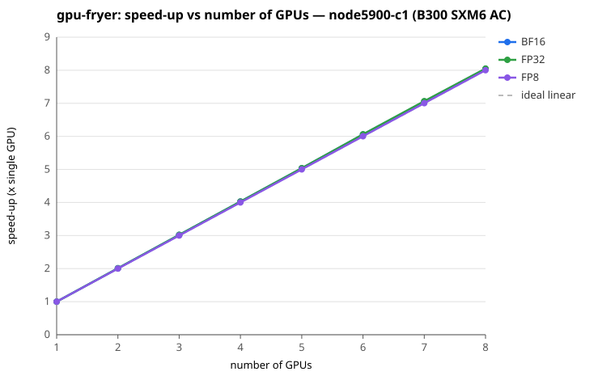

# gpu-fryer summary

- Generated: 2026-10-05 16:34:41
- Nodes: node5900-c1 (8 x B300 SXM6 AC)
- Precisions: FP32, BF16, FP8
- Reference (MIT aicr-benchmarks, `gpu-fryer/summary.md`, b0025, **B200**): per-GPU mean TFLOP/s — FP32 772, BF16 1500, FP8 4115
- Note: the reference is a B200 node; the `% of B200 reference` comparison is only meaningful for B200 nodes and is shown as `—` for other GPU types.

## Per-node mean converged throughput (TFLOP/s)

| Node | GPU | FP32 | BF16 | FP8 | Health |
|------|-----|------:|------:|------:|---|
| node5900-c1 | B300 SXM6 AC | 797 | 1521 | 4228 | ok |
| **reference (b0025)** | **B200** | **772** | **1500** | **4115** | — |

## Speed-up vs number of GPUs

Shown for **node5900-c1**, one curve per precision.

| #GPUs | BF16 | FP32 | FP8 | ideal |
|------:|------:|------:|------:|------:|
| 1 | 1.00 | 1.00 | 1.00 | 1.00 |
| 2 | 2.01 | 2.01 | 2.00 | 2.00 |
| 3 | 3.02 | 3.02 | 3.00 | 3.00 |
| 4 | 4.03 | 4.03 | 4.00 | 4.00 |
| 5 | 5.04 | 5.04 | 5.00 | 5.00 |
| 6 | 6.06 | 6.06 | 6.00 | 6.00 |
| 7 | 7.05 | 7.06 | 7.00 | 7.00 |
| 8 | 8.04 | 8.05 | 8.00 | 8.00 |

> **How to read this.** gpu-fryer stresses all 8 GPUs *concurrently* and reports one converged figure per GPU — it does not run separate 1, 2, ... 8-GPU jobs. The curve above is therefore **derived** from that single run: speed-up(N) = (sum of GPUs 0..N-1) / GPU 0. It is linear by construction and is **not** a measured scaling study; what it shows is per-GPU *uniformity* — a curve that tracks the dashed ideal line means every GPU sustains the same throughput, while a curve bending below it marks a slow or throttling GPU. For real scaling behaviour see the Megatron-LM weak-scaling results in `output-megatron/summary.md`.

## Per-GPU converged throughput (TFLOP/s)

### node5900-c1 (8 x B300 SXM6 AC)

| GPU | FP32 | BF16 | FP8 |
|-----|------:|------:|------:|
| 0 | 792.0 | 1513.0 | 4226.0 |
| 1 | 800.1 | 1528.0 | 4225.9 |
| 2 | 800.3 | 1529.2 | 4225.9 |
| 3 | 798.1 | 1523.7 | 4225.9 |
| 4 | 798.9 | 1525.8 | 4233.5 |
| 5 | 811.6 | 1546.1 | 4233.1 |
| 6 | 794.4 | 1506.5 | 4225.8 |
| 7 | 781.3 | 1495.0 | 4225.8 |
| **min** | **781.3** | **1495.0** | **4225.8** |
| **mean** | **797.1** | **1520.9** | **4227.7** |
| **max** | **811.6** | **1546.1** | **4233.5** |

Converged = the final sustained-average throughput gpu-fryer reports per GPU at the end of each precision run. Higher is better; large spread across GPUs or any throttling flag indicates a problem.

