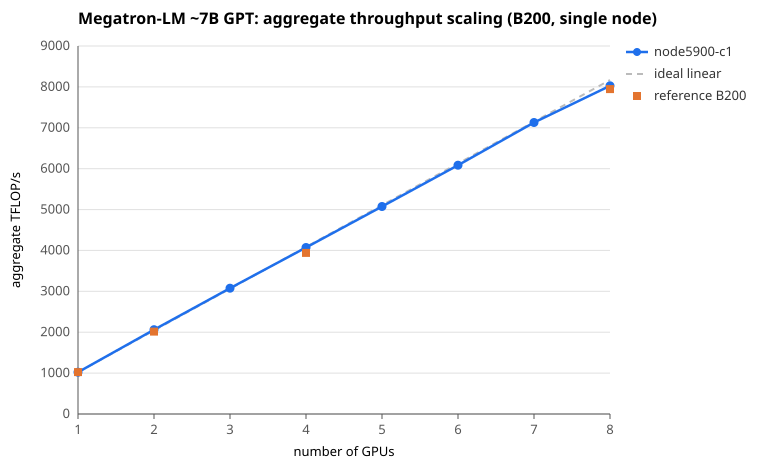

# Megatron-LM 1-node GPU sweep — B200

- Generated: 2026-10-04 20:09:59
- Nodes: node5900-c1 (single node each, data-parallel, TP=1, PP=1)
- Model: ~7B GPT — 36 layers, hidden 4096, FFN 14336, 32 heads, seq 2048, bf16
- Per run: micro-batch 4, global batch = 128 x total_GPUs, 100 iters, no activation recompute
- Metric: last-iteration throughput (TFLOP/s/GPU), same as the reference
- Reference: MIT aicr-benchmarks `megatron-lm/output/summary.md`, B200 1-node group

## Apples-to-apple vs B200 reference

| #GPUs | GBS | reference TFLOP/s/GPU | node5900-c1 TFLOP/s/GPU | node5900-c1 / ref |
|------:|----:|----------------------:|-----------------:|-----------:|
| 1 | 128 | 1024.4 | — | — |
| 2 | 256 | 1007.7 | — | — |
| 4 | 512 | 985.2 | 1026.8 | 104.2% |
| 8 | 1024 | 993.3 | — | — |

Reference values are the best B200 1-node result per GPU count from `summary.md` (last-iteration TFLOP/s/GPU).

## Scaling (1 -> 8 GPUs, single node)

### node5900-c1

| #GPUs | GBS | per-GPU TFLOP/s | aggregate TFLOP/s | iter (ms) | weak-scaling eff. | status |
|------:|----:|----------------:|------------------:|----------:|------------------:|--------|
| 1 | 128 | — | — | — | — | no data / failed |
| 2 | 256 | — | — | — | — | no data / failed |
| 3 | 384 | — | — | — | — | no data / failed |
| 4 | 512 | 1026.8 | 4107 | 10956 | — | ok |
| 5 | 640 | — | — | — | — | no data / failed |
| 6 | 768 | — | — | — | — | no data / failed |
| 7 | 896 | — | — | — | — | no data / failed |
| 8 | 1024 | — | — | — | — | no data / failed |

Aggregate = per-GPU x #GPUs. Weak-scaling efficiency = per-GPU(N) / per-GPU(1) on that node. Per-GPU work is held constant (GBS scales with #GPUs).

## Scaling figure

Aggregate throughput vs #GPUs: one curve per node, ideal linear scaling from the best 1-GPU point (dashed), and the B200 reference (orange).

